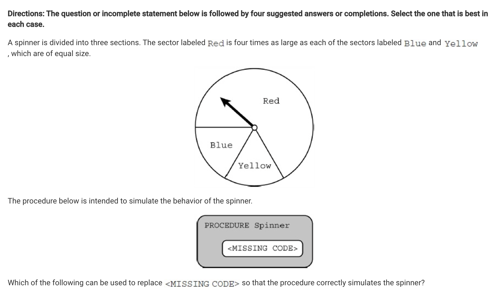
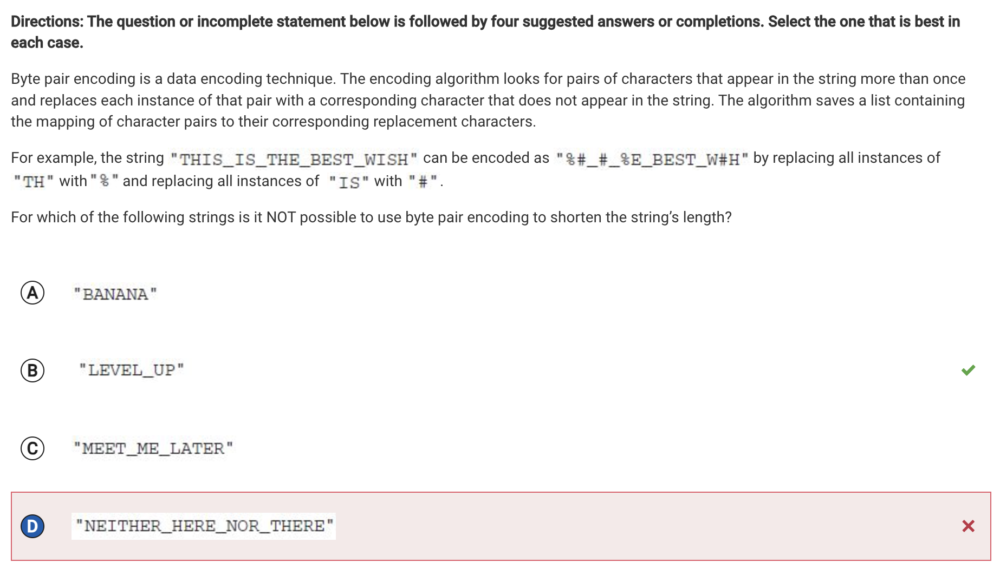
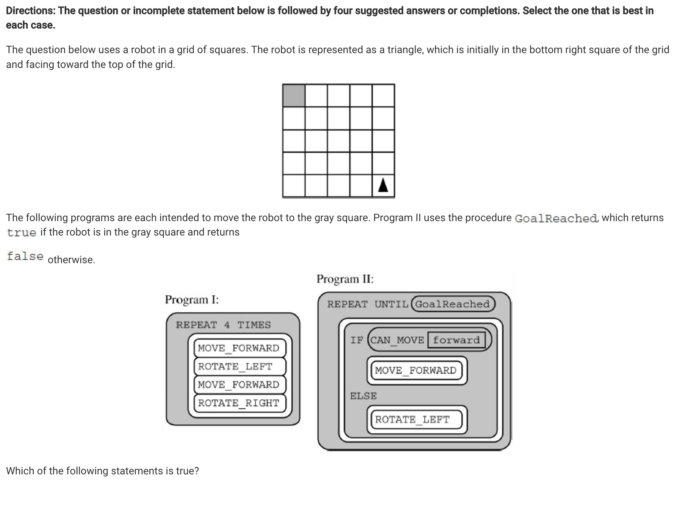
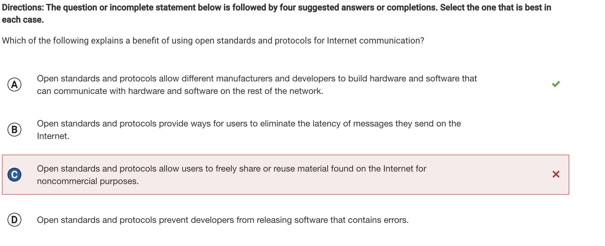
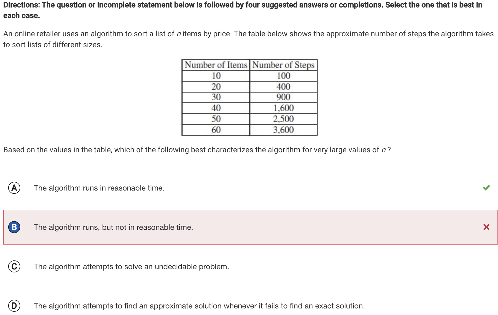
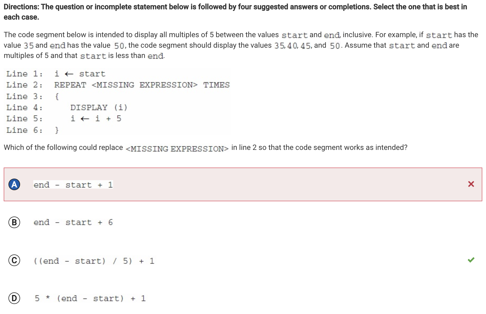
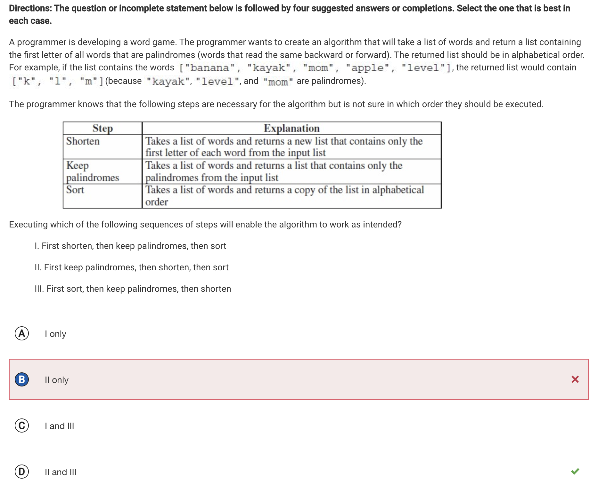
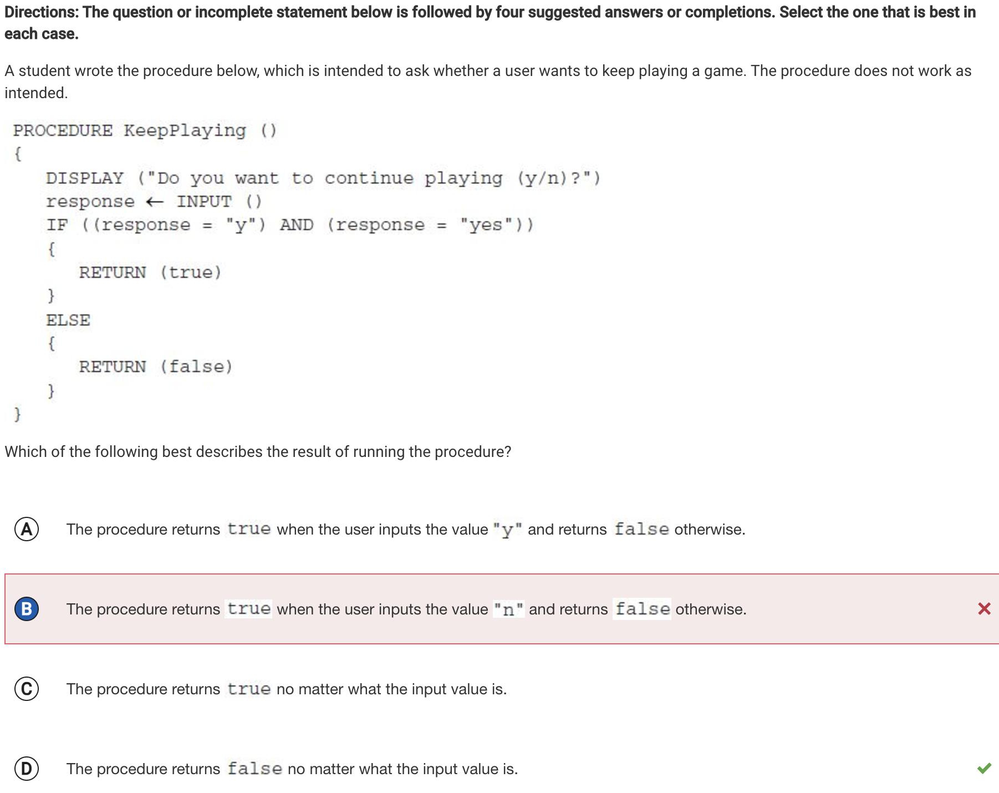

a. What you learned from this quiz

In this 2018 practice exam mcq I have learned the types of problems I will be tested on in the AP exam. 
Some of the topic I have learned from this quiz is cryptography and security, game logic, identifiying missing code, and figuring out unecessary lines of code. 

b. What type of questions do you feel you are weak on?

The type of questions that I personally felt were challenging and was weak on are the questions were it asks you which of the following replaces the code. One of these types questions which I got wrong is question 11 and question 26. Another type of question which is a weakness of mine, needing to be improved upon is making sure I have a more clear understanding of the procedure of code when ever it is given, for an example question 55.

Corrections:

Question 11:

The mistake I made in this question is getting the code segments wrong. Correct answer is C.

Question 25:

This is incorrect since the string can be shortened using byte pair encoding. Correct answer is B

Question 31:

I thought program 1 moved correctly to the grey square and program 2 did not however they both move the grey square. Correct answer C

Question 39:

I got this question wrong because I chosee the option that said open standards and protocols cannot be used to allow copyrighted materials to be shared freely. That is incorrect and the correct answer was A.

Question 43:

When attempting the problem I thought it would not be done in a reasonable amount of time due to the high amount of steps but it is done in a reasonable amount of time since the umber of steps of the algorithm is a polynomial, so the algorithm runs in reasonable time. The corrrect answer is B

Question 49:

I was unsure on how to do this problem correctly so I just guessed but the correct answer the problem was option A

Question 52:

I got this problem wrong because I did not take 3 into consderationg enough. Corection is D.

Question 55:

I did not understand this question leading me to guess B. The correct answer was D.