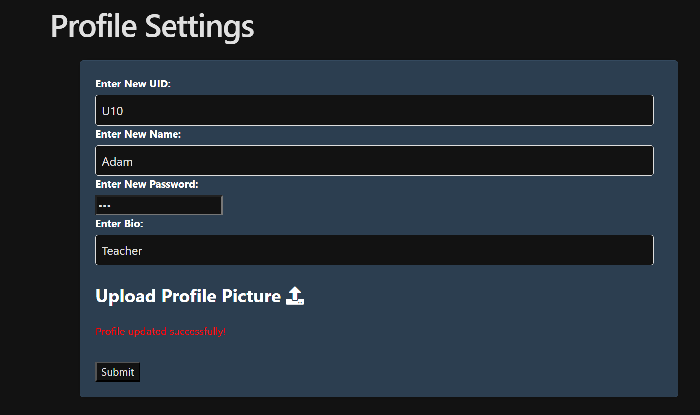
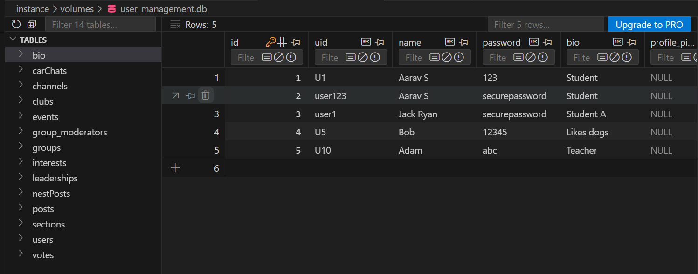
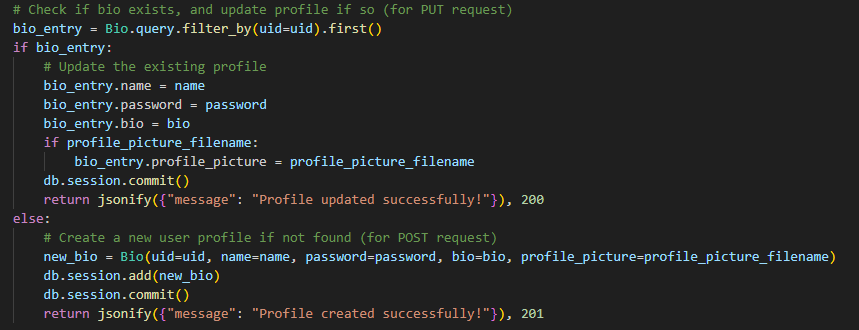
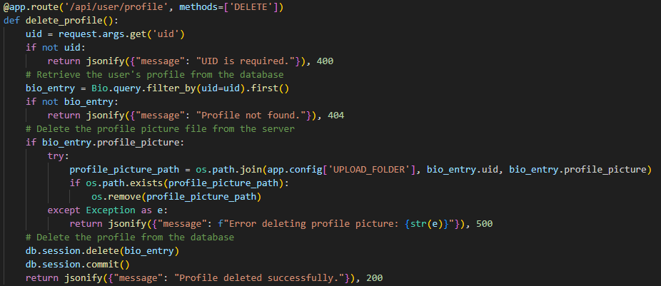
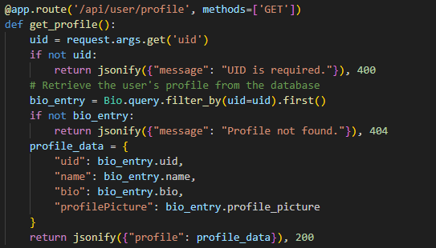
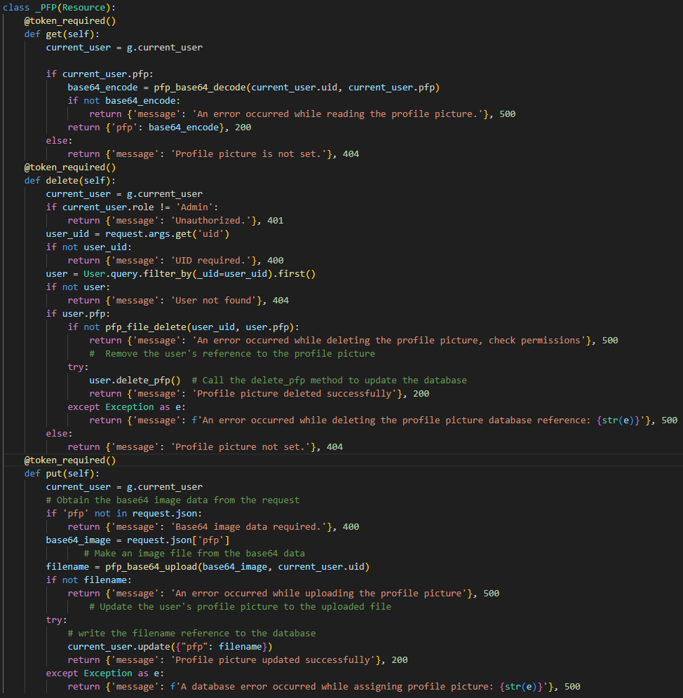
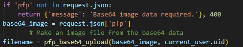
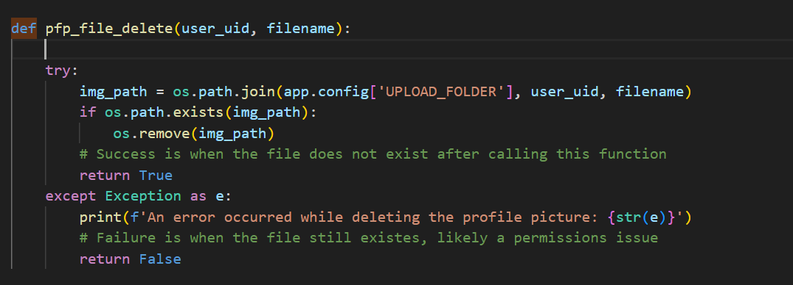

# Purpose of My Groups Program

The purpose of our group's program is to provide a platform for club leaders and members at Del Norte High School to communicate more effectively. The website streamlines the management of events, announcements, leadership roles, and member organization, creating a centralized space for club activities. It also enables students to discover clubs that match their interests, encouraging greater participation.

Many clubs currently lack a consistent communication platform—some use Instagram, others rely on group chats, while some have no system at all. This website brings all clubs together in one shared space by simplifying communication.

---

## My Individual Feature's Purpose

My individual feature allows users to manage their bios within their profiles seamlessly. Users can personalize their profiles by adding or editing their bios, ensuring their information remains relevant and up-to-date. They also have the flexibility to remove outdated bios if needed. This feature enhances user engagement by enabling members to share meaningful details about themselves, allowing for better connections and interactions within the platform.

---

## Input/Output Requests

- Within the frontend, whenever a user submits a profile, data is sent to the backend by sending a POST API request.
- This new data is then stored in the database within the `user_management.db` file.

---

## Visuals

### Example Screenshots





---

## Code Explanation

### Handling List Requests in Flask Using the Bio Class

In my Flask project, I used the Bio class to manage user profile data. This class represents database records where each row corresponds to a user profile, and columns store user details such as uid, name, password, and bio.

I worked with lists when handling multiple database rows and dictionaries to structure individual user data for API responses. Using SQLAlchemy, a third-party library, I queried the database and formatted the retrieved data in JSON to be sent to the frontend.

### List and Dictionary Representation in the Bio Class

The Bio class stores data in a relational format, where each row in the table corresponds to a user profile. Here’s how it’s structured:


class Bio(db.Model):
    __tablename__ = 'bio'  # Change the table name to 'bio'

    id = db.Column(db.Integer, primary_key=True)
    uid = db.Column(db.String(100), unique=True, nullable=False)
    name = db.Column(db.String(100), nullable=False)
    password = db.Column(db.String(100), nullable=False)
    bio = db.Column(db.String(500), nullable=True)
    profile_picture = db.Column(db.String(200), nullable=True)       
    created_at = db.Column(db.DateTime, default=datetime.utcnow)

    def __repr__(self):
        return f'<Bio {self.name}>'


**Lists in Bio Class:**
- When retrieving all user profiles, I use `Bio.query.all()`, which returns a list of Bio objects.
- Each object in the list represents a row in the database.

**Dictionaries in Bio Class:**
- Each Bio object is converted into a dictionary so it can be formatted as JSON for the API response.
- The keys in the dictionary represent the database columns, and the values contain the user’s data.

### List Requests: Use of Lists, Dictionaries, and Databases

In the context of your Flask application, you interact with a database where data is stored in tables (which you can think of as columns and rows). Here’s a breakdown of how your code works with lists and dictionaries when querying and returning data:

**Working with Lists (Rows) and Dictionaries (Columns) in the Database:**

In your code, the Bio model represents the structure of the database table that stores user profile data. When querying the database, you retrieve rows, each representing a user profile. You then convert each row into a dictionary (representing the columns of the table).

For instance, in the `get_profile()` function:

```python
@app.route('/api/user/profile', methods=['GET'])
def get_profile():
    uid = request.args.get('uid')
    if not uid:
        return jsonify({"message": "UID is required."}), 400
    # Retrieve the user's profile from the database
    bio_entry = Bio.query.filter_by(uid=uid).first()
    if not bio_entry:
        return jsonify({"message": "Profile not found."}), 404
    profile_data = {
        "uid": bio_entry.uid,
        "name": bio_entry.name,
        "bio": bio_entry.bio,
        "profilePicture": bio_entry.profile_picture
    }
    return jsonify({"profile": profile_data}), 200
```

- `filter_by()` retrieves the first matching row where the uid matches the request parameter.
- Once the profile is retrieved, you create a dictionary of the relevant data.

Here, each dictionary key (such as "uid", "name", etc.) represents a column in the database, while the values correspond to the data from that row.

### Formatting Response Data (JSON) from API into DOM

Once you’ve retrieved the data from the database and formatted it into a dictionary, the next step is converting that dictionary into a JSON response that can be returned to the user. Flask's `jsonify()` function makes this easy:

```python
return jsonify({"profile": profile_data}), 200
```

In this case, the `profile_data` dictionary is automatically converted to a JSON object, with the `profile` key containing the user’s profile data. This JSON response can then be processed on the client side and rendered into the DOM as needed. This is especially useful for rendering user profiles dynamically in web applications.

### Queries from the Database: Extracting Python List (Rows)

Your queries are provided by SQLAlchemy, a third-party library that works with your Flask application to interact with the database. In the case of your `get_profile()` function, you’re using the `filter_by()` method to extract a specific row based on the uid. Here’s how it works:

```python
bio_entry = Bio.query.filter_by(uid=uid).first()
```

- `Bio.query.filter_by(uid=uid)` generates an SQL query that filters the Bio table by the uid column.
- The `.first()` method returns the first result that matches the uid (or None if no match is found).

### CRUD Operations for User Profile in Flask API

In this section, we'll break down the CRUD (Create, Read, Update, Delete) operations for managing user profiles, specifically focusing on your Bio model and how these operations are implemented in your API.

#### Create: Adding a New Profile

The Create operation is responsible for adding new user profiles to the database. If a profile doesn’t exist for the given uid, a new profile is created. This is done in the `update_or_create_profile()` function where a POST request is made.



If the profile is not already present in the database, it is created by creating a new Bio object with the provided data (uid, name, password, bio, and the optional profile_picture). The new entry is added to the session and committed to the database.

#### Update: Modifying an Existing Profile

The Update operation is designed to modify existing profile data. In your case, this is done via a PUT request in the `update_or_create_profile()` function. If a profile already exists (as identified by the uid), the provided data (name, password, bio, and optional profile_picture) is used to update the existing profile in the database. After updating the profile attributes, the changes are committed to the database.

#### Read: Retrieving Profile Data

The Read operation fetches the profile information from the database. In your code, this is handled by the `get_profile()` function, which retrieves the user profile by uid.


Here, a GET request is made, and it looks up the Bio table for a profile with the given uid. If no such profile exists, a 404 response is returned. If the profile is found, the profile data is returned in the response in JSON format. This code extracts the profile data from the `bio_entry` object and formats it into a dictionary, which is then returned as a JSON response.

#### Delete: Removing a Profile

The Delete operation removes a profile from the database. The `delete_profile()` function performs this action:



It checks if the profile exists by querying the Bio table using the uid. If the profile exists, it deletes the profile picture from the server and then deletes the profile record from the database.

### Algorithmic Code Request: Handling API Requests in Flask

In this section, we’ll dive into the different algorithmic elements and design choices used to handle requests in your Flask API. We will cover the use of code blocks to handle different types of requests (GET, POST, PUT, DELETE), how the API class functions, and how sequencing, selection, and iteration are implemented. Finally, we’ll discuss the request parameters, how data is passed in the body of requests, and how the response is formatted using `jsonify()`.

#### Definition of Code Blocks to Handle a Request

To handle a request in Flask, we define specific routes and associate them with handler functions that process the request and return a response. Each route corresponds to a method, such as GET, POST, PUT, or DELETE.

For example, to define a route for getting a profile, we use the following code block:



Here, the code block listens for a GET request at the endpoint `/api/user/profile`. When a request comes in, the function checks for the required uid parameter, queries the database for the profile, and returns the profile data in a structured JSON format.

#### API Class for GET, POST, PUT, and DELETE Methods

In Flask, the `flask_restful` extension provides the Resource class, which helps to organize the handling of HTTP methods (GET, POST, PUT, DELETE). Each method is mapped to a corresponding function inside a class that inherits from Resource.

For example, here's the API class you use to handle profile picture operations:



In the above example:
- **GET** retrieves the profile picture in base64 format.
- **DELETE** removes the profile picture for the specified user.
- **PUT** updates the profile picture with a new image.

Each of these methods corresponds to a specific HTTP verb and performs different actions on the data.

#### Sequencing, Selection, and Iteration

The logic inside these methods often involves sequencing (steps taken in a particular order), selection (conditional checks), and iteration (repeated actions).

For example, in the `put()` method for updating the profile picture, we have sequencing and selection:



**Sequencing:** The steps to validate and upload the image happen in order, first checking the request body and then proceeding to decode and upload the image.

**Selection:** If the `pfp` key is missing from the request, the method returns an error message.

**Iteration:** There is no explicit iteration in this example, but iteration would typically occur if you were processing multiple images or handling multiple users in a list.

#### Parameters and Return Type

The parameters for these functions come from two main sources:

- **Request Body:** For POST and PUT requests, the body is typically in JSON format. In the `put()` method, for example, we expect the body to contain base64-encoded image data under the key `pfp`:

```python
base64_image = request.json['pfp']
```

- **Query Parameters:** For GET and DELETE requests, parameters are often passed in the URL or query string. For example, in the `delete_profile()` function, the uid is passed as a query parameter:

```python
uid = request.args.get('uid')
```

**Return Type:**

The return type of these functions is always JSON, formatted using the `jsonify` function from Flask. Each response is wrapped in a dictionary, and the `jsonify` function ensures the response is properly formatted as JSON.

For example, a successful GET request might return:

```python
return jsonify({"profile": profile_data}), 200
```

Where `profile_data` contains the user profile details. The HTTP status code (e.g., 200 for success, 400 for bad request) is also included in the response.

If there’s an error, a JSON object containing an error message is returned:

```python
return jsonify({"message": "UID required."}), 400
```

This structure makes it easy for the front end to handle the response consistently, checking the status code and displaying relevant data or error messages to the user.

---

## CPT Requirements Fulfilled

When a user clicks Submit on the frontend, their profile data is sent to the backend and stored in a database. This simple action ties into key development concepts:

- **Debugging (Big Idea 1.4):** Using Postman to test the API and ensure data is saved correctly in the backend.
- **Data Management (Big Idea 2):**
  - **Storage:** SQLite stores user profiles efficiently.
  - **Security:** Authentication ensures only authorized users can save or retrieve data.
- **Internet & Deployment (Big Idea 4):**
  - **APIs:** The frontend sends a POST request to store the profile.

### Call to Method with Algorithm (Fetch to Endpoint)



- **Normal Condition:** If the file exists, it is deleted with `os.remove(img_path)`, and the function returns True.
- **Error Condition:** If the file doesn’t exist or a permissions error occurs, it logs the issue and returns False.

Use SQLAlchemy to query the database and get user data before performing file operations (e.g., retrieving the user’s unique ID and profile picture filename). SQLAlchemy simplifies working with the database by converting query results into Python objects or lists.

**Example:** Retrieve all users from the database with `Bio.query.all()` (returns a list of all user records).

The flow involves querying the database to get the necessary data (like `user_uid`), and then using that data to interact with the filesystem, such as deleting a profile picture with `pfp_file_delete()`.