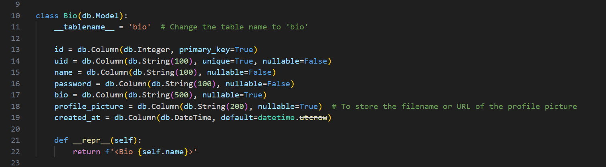

# Purpose of My Groups Program

The purpose of our group's program is to provide a platform for club leaders and members at Del Norte High School to communicate more effectively.

The website streamlines the management of events, announcements, leadership roles, and member organization, creating a centralized space for club activities. It also enables students to discover clubs that match their interests, encouraging greater participation.

Many clubs currently lack a consistent communication platform—some use Instagram, others rely on group chats, while some have no system at all. This website brings all clubs together in one shared space by simplifying communication.

---

## My Individual Feature's Purpose

My individual feature allows users to manage their bios within their profiles seamlessly. Users can personalize their profiles by adding or editing their bios, ensuring their information remains relevant and up-to-date.

They also have the flexibility to remove outdated bios if needed. This feature enhances user engagement by enabling members to share meaningful details about themselves, allowing for better connections and interactions within the platform.

---

## Input/Output Requests

- Within the frontend, whenever a user submits a profile, data is sent to the backend by sending an API request to the backend.
- This new data is then stored in the database within the `user_management.db` file.

---

## Visuals

### Example Screenshots

---

## Code Explanation

The code I created defines a SQLAlchemy model class named `Bio`, representing a database table called `'bio'`. 

This table stores user profile information with fields including:
- `id` (a unique primary key)
- `uid` (a unique user identifier)
- `name`
- `password`
- `bio` (a personal description)
- `profile_picture` (a string to store a filename or URL for the profile picture)
- `created_at` (a timestamp with a default value of the current time).

The `__repr__` method returns a string representation of the object for debugging. 

The model ensures structured storage of user profiles and facilitates efficient database operations.
